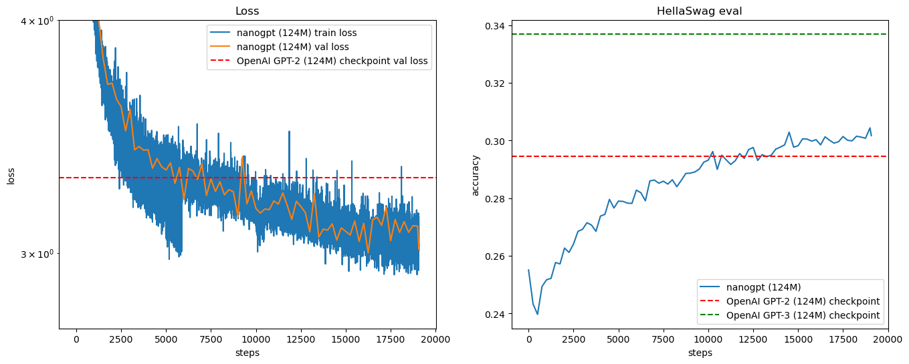
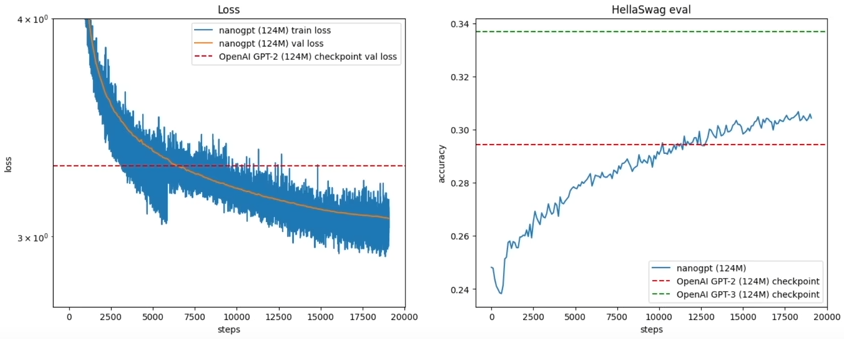

This is my personal project to reproduce the results of OpenAI's GPT2-Small version. I got inspired by Andrej Karpathy's video [Let's reproduce GPT-2 (124M)](https://youtu.be/l8pRSuU81PU)

# What is this?
The remarkable power of OpenAI's ChatGPT-4o1 really piqued my curiosity: what's behind all this sorcery? How come that such seemingly simple mathematical operations, matrix multiplications, additions and non-linearity functions chained together can give rise to something that can mimic intelligent human conversation so closely? Is this really what intelligence is? Does it become "alive" just because it can act, very believably so, like a living thing? Fascinating questions, but I am moved utmost by the most fun of all:

### **How does it work?**

What I cannot create, I do not understand!


Thus this repo exists.

# Goal
Andrej Karpathy is great. He is just great. When I saw he released his video [Let's reproduce GPT-2 (124M)](https://youtu.be/l8pRSuU81PU) my goal was clear: understand every step he makes, the reasoning why he does so and reproduce the results. More precisely, reproduce OpenAI's results of GPT2-Small version (124 million parameters), based on the papers [[1]] and [[2]] guided by Andrej's video.

**Learning loop**: watch the video, read the papers (and some others that I've found really helpful too, linked at the bottom), make notes, close the solution, code it from scratch, play with the results, compare with Andrej's code, take over his solutions where I found they were superior and refactor where needed. Repeat.

So, I built the GPT-2 code, and randomly initialized a GPT-2 model. From meaningless jibber-jabber, starting with my hardcoded context `I have no idea what I'm doing, but`

```
I have no idea what I'm doing, but punk obfuscBostonsided periodicHu observable Lionellication989phicallGridEspecially hordes tc NAS periodicdriving accur
```

I wanted to get to a point where my GPT can generate some tiny tiny spark of linguistic intelligence. Well, after training on 10 billion tokens it got to the point where it *sometimes* starts making sense!

```
I have no idea what I'm doing, but I'm really interested to understand if something as simple as something as this... could be the secret behind it and how the same thing can be used in so many different ways.
In terms of being

I have no idea what I'm doing, but thanks."
"The answer to my question, or so many questions..."
"It's not clear, but I really love this question of my very own, and I have never been particularly excited

I have no idea what I'm doing, but it's fun!
It's been a busy week, too...
I had to cut out the paper for my own project, too. I did not have time for this project, so that
```

Note that I did not upload my trained model because it's quite big (1.4GB), and it's not really useful for anyone besides me playing with it for the sake of this project. As an alternative, you can access the HuggingFace version of GPT-2 Small (124M) as I did in my `sample.ipynb`.

# Technical overview

In the following I write a short summary of the technical details of the model, training and the hardware. It's only a shorter version of my own notes, a reminder! The thorough description of these topics can be found in the [Let's reproduce GPT-2 (124M)](https://youtu.be/l8pRSuU81PU) video, the corresponding [build-nanogpt](https://github.com/karpathy/build-nanogpt) repo, and in the references I linked.

## Model

- GPT-2 uses the self-attention transformer decoder-only architecture from [[3]], except that the layer normalization was moved to the input of each sub-block and an additional layer normalization was added after the final self-attention block [[1]].
- The head of the languge model uses the token embedding matrix from the start of the transformer to compute the output logits, i.e. the input and output embedding matrices are the same (weight sharing) [[9]]. *Short reason: tokens that are "synonyms", and thus have similar input embeddings, should really have similar probabilities in the end (because they can be used interchangeably), and thus should have similar output embeddings*
- The model uses the accelerated version of attention (flash attention [[4]]).
- The model was compiled via `torch.compile` [[6]] to reduce unnecessary python interpreter calls and fuse cuda kernels where such opportunities are found by PyTorch.

| **Model Parameters**              | #     | Comment                                                                              |
|-----------------------------------|-------|--------------------------------------------------------------------------------------|
| Context length                    | 1024  |                                         |
| Vocabulary size (GPT-2 tokenizer) | 50257 | = 50000 byte pair encoding merges + 256 bytecodes + 1 special <\|endoftext\|> token |
| Embedding dimension               | 768   |                                                                                      |
| Number of attention heads         | 12    |                                                                                      |
| Head dimension                    | 64    | = Embedding dimension / Number of attention heads                                    |
| Feedforward layer dimension       | 3072  | = 4 * Embedding dimension                                                            |
| Number of transformer layers      | 12    |                                                                                      |

## Training
- For training I used HuggingFace's [FineWeb Dataset](https://huggingface.co/spaces/HuggingFaceFW/blogpost-fineweb-v1), more specifically the 10 billion token version `sample-10BT` of the [FineWeb-Edu Dataset](https://huggingface.co/datasets/HuggingFaceFW/fineweb-edu) which is a collection of high quality educational content scraped from the web. Since the 10 billion token dataset cannot be loaded all at once, it is separated to chunks (aka shards) of 100 million tokens. A batch for a single training step is loaded from these shards. The data preprocessing related content that I took over from Andrej can be found in `fineweb.py`
- `TensorFloar32` precision is used [[5]] instead of the highest `float32` precision, resulting in significant speedups during the training.
- AdamW optimizer is used instead of Adam for faster convergence (i.e. lower training loss) and better generalization performance (i.e. lower validation/test error) [[7]], [[8]].
- The batch size is taken from the GPT-3 paper [[2]], from the GPT-3 Small architecture, where they used a 0.5 million batch size. Since this does not fit into a single forward-backward-update cycle (not enough GPU memory), the gradient is accumulated by iterating with smaller batches, calling forward-backward, but **without** calling update or zeroing out the gradients. Once we cumulatively passed roughly 0.5 million tokens, the accumulated gradients are avaraged out and used to update the model parameters. Then, the gradients are zeroed out, and the next gradient accumulation starts.
- Learning rate is changed during training: it is increased linearly at the beginning (warmup phase), up to a maximum value, then decreased to its minimum value via cosine decay.

| **Training Parameters**        | #          | Comment                                                                                                                        |
|--------------------------------|------------|--------------------------------------------------------------------------------------------------------------------------------|
| Number of GPUs in the training | 1          | My NVIDIA RTX 4070 Super                                                                                                       |
| Number of training tokens      | 10 billion | = the fineweb-edu-10B dataset                                                                                                  |
| Batch size                     | 524288     | Around 0.5M in GPT-3 paper, but rounded up a bit to contain lots of power of two (e.g. divisible with the context length 1024) |
| Micro batch size               | 8          | This is what reliably fits to the 12GB VRAM in my RTX 4070 Super                                                               |
| Gradient accumulation step     | 64         | = Batch size / (Micro batch size * Context length * Number of GPUs in the training)                                            |
| Max steps                      | 19073      | = Number of training tokens / Batch size ; it's not an integer, so it is floored to 19073                                      |
| Max learning rate              | 6e-4       | Maximum learning rate is reached after a linear warmup from zero.                                                              |
| Min learning rate              | 6e-5       | Minimum learning rate is reached after a cosine decay from maximum learning rate.                                              |
| Leanring rate warmup steps     | 715        | Warmup spans across the first 715 steps of training.                                                                           |


## Hardware
Originally I planned to run the training on [Lambda](https://lambdalabs.com/) cloud on 8x NVIDIA A100 SXM GPUs (hence I also coded the [Distributed Data Parallel](https://pytorch.org/tutorials/intermediate/ddp_tutorial.html) configuration part, preparing for training on multiple GPUs), but it turned out that my own RTX 4070 Super was sufficient to execute the training with fraction of the price (albeit running for 25x longer).

|         | Lambda On-demand 8x NVIDIA A100 SXM | My own PC NVIDIA RTX 4070 Super                                         |
|---------|-----------------------------------------|-------------------------------------------------------------------------|
| Training time | ~2 hours                                | ~50 hours                                                               |
| Price   | USD 35-40 (including VAT)               | USD 2-3 (based on the current electricity prices and power consumption) |

Thus I picked my own RTX 4070 Super, and went brrr for 2.5 days with it.

# Results

The [HellaSwag](https://rowanzellers.com/hellaswag/) dataset was used for evaluating the model's performance. It contains questions and answers that are constructed in an adversarial way, such that they are trivial for humans, but were quite challenging back in 2019 for state of the art language models. The idea behind this dataset is to test common-sense: although all answers are grammatically and linguistically correct, they are total nonsense, given the question. Each question has four different answers, with only a single correct answer.

Note, that nowadays large language models have no trouble reaching human level performance on HellaSwag, but back in 2019 it was still a challenging measure of artificial lingusitic intelligence.

#### But how does this pretrained-only GPT model answers questions?

In this project, I do not train my GPT model to become a helpful chat assistant, it's just a document filler. It is unable to answer questions in a regular "test" style, asking it to pick an answer A, B, C or D for a specific question. Instead, given a question Q with its answers A, B, C and D, they are combined together: the question Q is prepended for each answer, and they are feeded to the model in a single `4 x (q + a)` batch of data, where `q` is the length of question Q and `a` is the length of the longest answer (so all answer can fit). After the forward pass, we can calculate the loss for each token in each answer, not counting the padded areas at the very end, if there are any. We choose the answer that has the lowest average loss.

I took over Andrej's logging and plotting code to visualize the results.

My results:



Andrej's results:



The training loss and HellaSwag results are quite close to each other, but there is a noticably higher noise in the validation loss for my run.

#### Why is the validation loss so noisy in my case?

In Andrej's code, I discovered that he uses a fixed minibatch of the validation set to calculate the validation loss. In my code I keep iterating over the complete validation set, taking a different batch for each validation loss calculation, which in turn results in a much noisier graph. I'm still not sure why Andrej kept using such a small subset of the validation data, I think that might be a bug.

# Conclusion

Microsoft has suggested that GPT-4, beyond its mastery of language, represents an early yet incomplete version of artificial general intelligence [[10]]. I think we can all agree that this is not an entirely unreasonable observeration. However, with the funny, strange, and trivial errors it can make, along with the obvious and blatant hallucinations it can confidently present, it is clear that it's still far from complete. Understanding how this "mimicry" of intelligence has evolved so rapidly is crucial to be able to actively participate in the process.

So, why is old, not-so-awesome GPT-2 important?

The architecture of GPT-4 is unfortunately not published, but based on the public GPT-2 and GPT-3 versions, we can at least give an educated guess what might lie behind these remarkable capabilities. Surely, GPT-4 is much larger, and was trained using an unprecedented scale of compute and data, but the foundations are probably quite similar. Foundations that can be understood by building the old, not-so-awesome GPT-2 from scratch.

Thus this repo exists.

# References

[1]: https://cdn.openai.com/better-language-models/language_models_are_unsupervised_multitask_learners.pdf "Language Models are Unsupervised Multitask Learners (GPT-2)"
[[1]] Language Models are Unsupervised Multitask Learners (GPT-2) - [Link](https://cdn.openai.com/better-language-models/language_models_are_unsupervised_multitask_learners.pdf)

[2]: https://arxiv.org/pdf/2005.14165 "Language Models are Few-Shot Learners"
[[2]] Language Models are Few-Shot Learners (GPT-3) - [Link](https://arxiv.org/pdf/2005.14165)

[3]: https://arxiv.org/pdf/1706.03762 "Attention Is All You Need"
[[3]] Attention Is All You Need - [Link](https://arxiv.org/pdf/1706.03762)

[4]: https://arxiv.org/pdf/2205.14135 "Flash Attention"
[[4]] Flash Attention Fast and Memory-Efficient Exact Attention with IO-Awareness - [Link](https://arxiv.org/pdf/2205.14135)

[5]: https://pytorch.org/docs/stable/generated/torch.set_float32_matmul_precision.html "torch.set_float32_matmul_precision"
[[5]] `torch.set_float32_matmul_precision("high")` - [Link](https://pytorch.org/docs/stable/generated/torch.set_float32_matmul_precision.html)

[6]: https://pytorch.org/tutorials/intermediate/torch_compile_tutorial.html "torch.compile"
[[6]] `torch.compile` - [Link](https://pytorch.org/tutorials/intermediate/torch_compile_tutorial.html)

[7]: https://arxiv.org/pdf/1711.05101 "Decoupled Weight Decay Regularization"
[[7]] "Decoupled Weight Decay Regularization" - [Link](https://arxiv.org/pdf/1711.05101)

[8]: https://pytorch.org/docs/stable/generated/torch.optim.AdamW.html "AdamW"
[[8]] `torch.optim.AdamW` - [Link](https://pytorch.org/docs/stable/generated/torch.optim.AdamW.html)

[9]: https://arxiv.org/pdf/1608.05859 "Using the Output Embedding to Improve Language Models"
[[9]] Using the Output Embedding to Improve Language Models - [Link](https://arxiv.org/pdf/1608.05859)

[10]: https://arxiv.org/pdf/2303.12712 "Sparks of Artificial General Intelligence: Early experiments with GPT-4"
[[10]] Sparks of Artificial General Intelligence: Early experiments with GPT-4 - [Link](https://arxiv.org/pdf/2303.12712)

Andrej Karpathy's video [Let's reproduce GPT-2 (124M)](https://youtu.be/l8pRSuU81PU) and the corresponding [build-nanogpt](https://github.com/karpathy/build-nanogpt) repo.